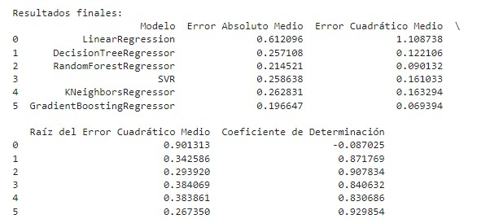

# Proyecto-Integrador-M6
Proyecto Integrador: Machine Learning | BootCamp Henry: Carrera Data Science | Chohorte DataFT20

**Modulo 6**: Machine Learning
**Instructor Henry**: Mario Sauza

# 🚗 Proyecto Integrador: Predicción de Datos en el Mercado Automotor 🛠️

¡Bienvenidos al emocionante proyecto integrador de predicción de datos en el mercado automotor! 🎉

Durante este desafío, exploraremos, entenderemos y modelaremos las características de los vehículos en el mercado actual utilizando habilidades avanzadas en machine learning. Este proyecto, parte del Módulo 6 del Bootcamp, proporciona una valiosa práctica previa a la etapa de Labs, permitiéndonos aplicar nuestros conocimientos en un contexto práctico y relevante. 🚀

## 📋 Planteamiento de la Problemática 🤔

Nuestro cliente, una prestigiosa automotriz china, tiene la ambición de ingresar al competitivo mercado de automóviles local. Con el objetivo de captar a todos los segmentos de público, es fundamental realizar un análisis exhaustivo de las características de los vehículos existentes en el mercado. Para ello, se nos ha proporcionado un detallado diccionario de datos que incluye precios y atributos de varios modelos de automóviles. 📊

## 🎯 Objetivos del Proyecto 🎯

1. **Implementar un Modelo de Clasificación**: Desarrollaremos un modelo de clasificación capaz de distinguir entre vehículos de gama alta y gama baja. Esto permitirá a nuestra automotriz identificar las características clave asociadas a cada segmento del mercado. 🎨

2. **Implementar un Modelo de Regresión**: También crearemos un modelo de regresión para predecir el precio final de los vehículos. Esta herramienta será invaluable para nuestra empresa al establecer estrategias de precios competitivos y rentables. 💰

## 🌟 Sobre el Instructor 🌟

Nuestro talentoso instructor, Mario Sauza, guiará nuestro viaje a través de este apasionante proyecto. Con su vasta experiencia en machine learning y su enfoque práctico, nos brindará las habilidades y conocimientos necesarios para abordar con éxito los desafíos de este proyecto. 🎓

---

En este proyecto, nos sumergiremos en el fascinante mundo del mercado automotor, aplicando técnicas avanzadas de machine learning para obtener valiosos insights y tomar decisiones estratégicas fundamentadas. ¡Prepárate para un emocionante viaje de aprendizaje y descubrimiento! 🚗💡

---

### Análisis de Mercado del Sector Automotor 🚗💼

El dinamismo del mercado automotriz está estrechamente entrelazado con las preferencias culturales arraigadas en cada región. Por ejemplo, mientras que en América del Norte se valora considerablemente la potencia de los motores y la presencia imponente de vehículos de gran tamaño, en Europa la prioridad recae en la eficiencia de combustible y el diseño compacto. Por otro lado, en América Latina, se da una mayor importancia a los precios accesibles y competitivos. Este fenómeno no solo se limita a diferencias geográficas, sino que también se ve influenciado por factores socioeconómicos y culturales específicos de cada país.

Es importante destacar que un mismo modelo de vehículo puede experimentar una variación significativa en su valor de mercado de un país a otro. Esta disparidad no se explica únicamente por impuestos y costos de producción, sino también por la manera en que el modelo es percibido y demandado en cada mercado local.

En resumen, el mercado automotriz es un escenario complejo donde convergen una variedad de factores que van más allá de las características técnicas de los vehículos. La comprensión de las particularidades culturales, socioeconómicas y regionales es esencial para el éxito en la comercialización de automóviles a nivel global.

### Planteamiento de la Problemática 🤔🔍

Como parte del equipo de ciencias de datos de una prestigiosa consultora, hemos sido encargados de realizar un estudio de mercado para una destacada automotriz china que tiene la intención de ingresar al mercado de automóviles local. La tarea principal consiste en analizar las características de los vehículos disponibles en el mercado actualmente. Dado que la empresa cuenta con una amplia gama de modelos estratificados según las preferencias de cada región, se busca comprender las características distintivas de los vehículos de gama alta y baja en nuestro mercado, con el objetivo de satisfacer las demandas de todos los segmentos de consumidores y establecer una correcta política de precios.

Para este fin, nuestro equipo ha recopilado datos sobre precios y características de varios modelos de vehículos disponibles en el mercado local, junto con sus respectivos precios de venta al público. Además, hemos creado un diccionario de datos que describe cada variable recopilada, facilitando así la comprensión de los datos a analizar.

Siguiendo las indicaciones del líder de datos, se nos ha recomendado llevar a cabo un análisis exhaustivo de los datos, realizar el preprocesamiento necesario y diseñar dos modelos predictivos: uno para predecir el precio de los vehículos y otro para distinguir entre vehículos de gama alta y baja, utilizando la mediana de los precios como punto de referencia. Asimismo, se espera que entreguemos los resultados de las predicciones en formato de texto plano.

Además del análisis detallado y la exploración de los datos, se nos ha encomendado la implementación de dos tipos de modelos predictivos:

- Un modelo de clasificación con aprendizaje supervisado para categorizar los precios de los vehículos como baratos o caros, utilizando la mediana de los precios como punto de corte.
- Un modelo de regresión con aprendizaje supervisado para predecir el precio final de los vehículos.

Este proyecto se dividirá en tres fases principales: preparación de los datos, análisis exploratorio de los datos y modelado/evaluación. Durante estas etapas, nuestro objetivo será generar insights valiosos para la automotriz china y proporcionar recomendaciones basadas en datos sólidos para su incursión exitosa en nuestro mercado automotriz local.

### Preparación de los Datos 🛠️📊

Durante el proceso de limpieza y preparación de datos del conjunto 'ML_cars original.csv', se llevaron a cabo una serie de acciones significativas para asegurar la calidad y la coherencia de los datos, con el objetivo de establecer una base sólida para análisis y modelos predictivos futuros. Los resultados obtenidos, junto con las métricas de memoria, demuestran la eficiencia del conjunto de datos en términos de tamaño de memoria, lo cual es crucial para un análisis de datos eficiente y un rendimiento óptimo. A continuación, se detallan los principales hallazgos y acciones realizadas:

**Tamaño del Conjunto de Datos:**
- Número de variables: 26
- Número de observaciones: 205

**Características Generales:**
- Ausencia de filas duplicadas y valores nulos en todas las columnas.
- Columnas discretas: 8
- Columnas continuas: 8
- Columnas categóricas: 10

**Optimización de la Memoria:**
- Tamaño total en memoria: 42.57 KiB
- Tamaño promedio de registro en memoria: 0.21 B

Estos valores indican una eficiencia notable en el uso de memoria, lo cual es esencial para realizar análisis de datos eficientes y garantizar un rendimiento óptimo del sistema.

**Normalización y Transformación de Datos:**
- Normalización de nombres de columnas para garantizar consistencia y claridad.
- Mapeo de valores en las columnas 'door_number', 'cylinder_number' y 'symboling' para mejorar la interpretación de los datos.
- Se agregaron dos variables nuevas: 'calificacion_riesgo' (con valores como "Extremadamente Riesgoso", "Riesgoso", etc.) y 'clasificacion_precio' (1 para valores por debajo de la mediana y 0 para valores por encima), lo que permite clasificar los vehículos como baratos o caros.
- Se redondearon los valores en la columna 'price' y se convirtieron a enteros para mayor coherencia y facilidad de análisis.

**Exploración de Outliers:**
- Se identificaron visualmente outliers en los datos, los cuales fueron retenidos debido al tamaño relativamente pequeño del conjunto de datos y su posible relevancia en análisis futuros.

En resumen, la preparación de datos realizada ha permitido mejorar la calidad y la coherencia del conjunto de datos, facilitando así análisis posteriores y la construcción de modelos predictivos. Los datos limpios y optimizados se exportaron como 'ML_cars limpio.csv', listos para su utilización en análisis y modelado subsiguientes.

### Análisis Exploratorio de Datos 🔎📈

El análisis exploratorio de datos realizado nos ha proporcionado una comprensión detallada de la estructura y distribución de nuestro conjunto de datos, extraído del archivo 'ML_cars limpio.csv'. A continuación, presentamos las conclusiones clave derivadas de esta fase:

**Distribución Estadística de Variables Numéricas:**
- Las estadísticas descriptivas revelan una amplia diversidad en la magnitud de las variables numéricas. Por ejemplo, la distancia entre ejes (wheel base) oscila entre 86.6 y 120.9, mientras que el peso en vacío (curb_weight) varía de 1488 a 4066. Esta variabilidad destaca la importancia del escalado de datos en etapas posteriores del análisis.

**Distribución de Variables Categóricas:**
- La exploración de variables categóricas, como el tipo de combustible, sistema de transmisión y tipo de carrocería, revela patrones y tendencias en nuestro conjunto de datos. Marcas como Toyota, Nissan, Mazda y Honda son dominantes, según la nube de palabras, y las características más comunes incluyen vehículos a gasolina, con transmisión estándar, tipo sedán y tracción delantera.

**Análisis Univariado de 'Price':**
- La variable 'price' es central para nuestro análisis. Observamos una amplia gama de precios, con una mediana de 10,295 y un promedio de 13,276. La presencia de valores atípicos, evidenciada por el máximo de 45,400, sugiere una distribución sesgada hacia la derecha. Se confirma esto al observar la skewness positiva y la kurtosis elevada.
- El análisis por categorías muestra diferencias significativas en los precios según el tipo de combustible, tracción, carrocería y otras características. Por ejemplo, los convertibles tienden a ser más costosos, y la tracción trasera (RWD) se asocia con precios más altos.

**Relaciones entre Variables:**
- El pairplot y el mapa de calor revelan relaciones entre variables numéricas. La correlación positiva entre 'price', 'curb_weight' y 'car_width' sugiere que, a menudo, precios más altos se asocian con mayor peso y anchura del automóvil.

**Marcas y Precios:**
- El análisis de marcas destaca que Toyota es la marca más común, mientras que BMW, Jaguar, Buick y Porsche tienden a tener precios más altos. Esta observación proporciona información valiosa para futuros análisis centrados en la marca.

En resumen, el análisis exploratorio de datos ha proporcionado una visión profunda de la distribución, relaciones y patrones en nuestro conjunto de datos, sentando así una base sólida para análisis más avanzados y modelado subsiguiente. Estas observaciones serán fundamentales para guiar nuestras decisiones en las etapas posteriores del proyecto.

### Resultados: Comparación de Modelos de Regresión 📊🔍

En esta fase del proyecto, se trabajó con el archivo 'cleaned_dataset.csv', realizando transformaciones de variables categóricas y numéricas. Se entrenaron y evaluaron varios modelos de regresión con el propósito de estimar el precio de vehículos. Para la evaluación se utilizó la validación cruzada, y la identificación de características más relevantes se llevó a cabo con SequentialFeatureSelection de la biblioteca scikit-learn. El objetivo principal fue comparar el rendimiento de distintos modelos y determinar cuál es el más adecuado para nuestro conjunto de datos.

A continuación, se presenta una tabla comparativa con los resultados obtenidos de los modelos de regresión utilizados en el proyecto. Esta tabla resume las métricas clave que evalúan el rendimiento de cada modelo en la tarea de predicción de precios de automóviles.

**Análisis de los Resultados Finales:**

Basándonos en las métricas evaluadas, el Gradient Boosting Regressor emerge como el modelo más adecuado para predecir los precios de los vehículos en este conjunto de datos. Ofrece el menor MAE, MSE y RMSE, así como el mayor R2, lo que indica que tiene el mejor rendimiento general en términos de precisión y capacidad de explicar la variabilidad en los precios de los automóviles.

### Resultados: Modelos de Clasificación 🏆🔍

En esta fase del proyecto, se trabajó con el archivo 'cleaned_dataset.csv', realizando transformaciones de variables categóricas y numéricas. Se entrenaron y evaluaron diversos modelos de aprendizaje supervisado para la clasificación, con el propósito de determinar si un automóvil es económico o costoso. La evaluación de los datos de entrenamiento se realizó mediante validación cruzada, y la selección de características relevantes se llevó a cabo con la ayuda de SequentialFeatureSelector de la biblioteca scikit-learn. Posteriormente, se comparó el rendimiento de los modelos para identificar cuál es el más adecuado para estos datos.

**Conclusión:**

Basándonos en las métricas evaluadas, el Gradient Boosting Classifier es el modelo más adecuado para la clasificación de automóviles en categorías de costos en este conjunto de datos. Ofrece la mayor exactitud, precisión, sensibilidad, especificidad y área bajo la curva (AUC), lo que indica un mejor rendimiento general en la tarea de clasificación.

### Conclusión Final 🎉🚀

Este proyecto ha sido una experiencia invaluable para aplicar habilidades avanzadas en machine learning en un contexto práctico y real. Explorar, comprender y modelar las distintas características de los vehículos en el actual mercado ha sido fascinante y enriquecedor para mi desarrollo profesional. Este proyecto me ha permitido consolidar mis conocimientos en el campo del análisis de datos y la inteligencia artificial, preparándome mejor para enfrentar desafíos futuros en este ámbito.

Quiero expresar mi más sincero agradecimiento a Mario Suaza, mi instructor durante esta travesía educativa, también a la plataforma Platzi en la cual pude reforzar muchos conocimientos. Su paciencia, dedicación y orientación han sido fundamentales para mi aprendizaje y crecimiento. Sin su apoyo, no habría podido alcanzar los logros que he obtenido en este proyecto y en todo el curso. Estoy profundamente agradecido por su invaluable contribución a mi formación académica y profesional.
